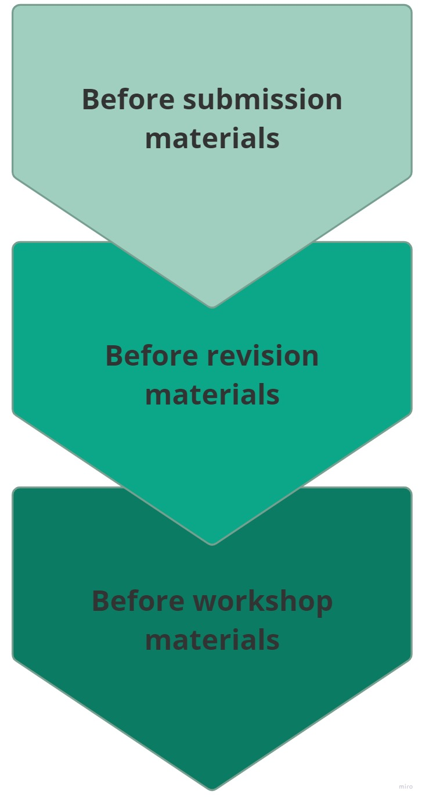

# New In ML workshop at ICML 2022

# Our Mission

Is this your first time to a top conference? Have you ever wanted your own work recognized by this huge and active community? Do you encounter difficulties in polishing your ideas, experiments, paper writing, etc? Then, this session is exactly for you!

This year, we are organizing the New in ML workshop, co-locating with [ICML 2022](https://icml.cc/). We are targeting anyone who has not published a paper at a top conference yet (e.g. ICML, NeurIPS). We invited top researchers to review your work and share with you their experience. The best papers will get oral presentations and awards!

Our biggest goal is to help you publish papers at next year's top conferences, and generally provide you with the guidance you need to contribute to ML research fully and effectively!

Within quota limits, the authors of the best accepted papers may be receiving the tickets to ICML 2022, to be attributed according to merit and need.

# Registration

It is a requirement to register for the [ICML 2022 conference](https://icml.cc/) in order to attend the workshops, socials and anything connected to the ICML Conference platform, **including** this workshop.

Once your ICML 2022 registration is active, it is not required to additionally register for **this workshop** in order to attend. However we would like to have an estimate of the number of attendees and their background. If you are interested in attending the New In ML workshop at ICML 2022, **please register** with this link (to update).

If you want to join the NewInML community, please leave your email address here: link (to update).

# Call For Extended Abstracts

This year, we initiate a call for extended abstracts with a novelty which is the **access to self-study writing support materials**. This year's NewInML session further targets new comers to the ML community, seeking writing practice and feedback to have the possibility to share their work at top conferences later on. To this aim, we are offering **online materials at the different stages of the submission process**:
* i) before submission (e.g writing process, basic language, macro-structure materials)
* ii) after review and before revision (e.g style and revising materials)
* iii) before the workshop (e.g presentations and posters help materials)

            

During the workshop, an additional 1-hour writing support presentation will take place, followed by a discussion with the authors for more tailored feedback and advices on their submitted abstracts. Therefore, this consists of a writing exercise though we also highly value promising works and novelties.

To practice writing good ICML papers, authors are **requested** to submit papers **respecting** the ICML [format and instructions](https://icml.cc/Conferences/2022/CallForPapers). **All submissions must be in PDF format. Submissions are limited to 3 content pages, including all figures and tables; additional pages containing the ICML paper checklist and references are allowed.** Submitted abstracts **must** be anonymous and respect the ICML format and template. Submissions that do not follow the format will be rejected. We restrict submissions to first authors with no prior accepted publication at ICML/NeurIPS main conferences and which are **not under review or accepted elsewhere**. Papers having been rejected before should be revised before submission to New In ML. We recommend sharing previous reviews with your new reviewers. Submitted papers will be reviewed by expert reviewers in a double-blind manner. Accepted abstracts could expect further coaching and mentorship if both reviewers and authors agree to communicate.

<b> This will NOT count as an official ICML publication, the NewInML 2022 workshop does not have a publication proceedings. Abstracts submitted can then be revised and enhanced for further submissions, but you should check the policy of other conferences if you want to re-submit elsewhere.</b> We allow the submission of abstracts that have been submitted to another workshop in condition that the other workshop does not have a publication proceedings and this does not violate the policy of the other workshop. You are responsible to check the dual-submission policy of the other workshop and decide whether you can re-submit your paper to the NewInML 2022 workshop. Accepted extended abstracts will be listed on the workshop homepage if the authors do not issue an objection. If an accepted paper is also accepted by another workshop, the authors can decide which workshop they want to keep. If you need to withdraw your abstract from the NewInML 2022 workshop, please contact us at contactnewinml (at) gmail.com.

Paper submission is through CMT platform: (update link)

Contact us at contactnewinml (at) gmail.com if you encounter technical issues.

All topics related to machine learning are welcome. They include but are not limited to:
- Computer Vision
- Natural Language Processing
- Graph Neural Networks
- Meta Learning
- Transfer Learning
- Reinforcement Learning
- Deep Learning Theory
- Deep Learning Interpretability
- Fairness and Privacy
- Automated Machine Learning
- Bayesian Machine Learning
- Causal Inference
- Adversarial Machine Learning
- Data, Competitions, Implementations, and Software
- Applications
- Neuroscience and Cognitive Science
- Optimization

# Important Dates

Paper submission deadline has been set to October 1, 2021 AoE.

* May 1st, 2022 (Anywhere on Earth): Paper submission deadline
* May 25th, 2022 (Anywhere on Earth): Author notification of acceptance
* July 22nd, 2022: Workshop day with best selected abstracts presentations

# Program

This will be a one-day **on site** event.

Program (time zone in Baltimore, Eastern Standard Time, EST, UTC−5 ):

Friday July 22, 2022

|**Time**  | **Event**|
|-|--------------------------------------------------|
|09:02 - 09:05| **Opening address** |
|09:05 - 09:50| **Invited Talk**  |
|09:50 - 10:35|  **Panel discussion** |
|10:35 - 10:50| Break |
|10:50 - 11:35| **Invited Talk**  |
|11:35 - 12:10| **Best abstracts presentations** (5 min + 5 min questions for each paper) |
|12:10 - 12:20| **Best extended abstract award** |
|12:20 - 14:30| Lunch Break |
|14:30 - 15:30| **Contributed talk** Writing support workshop |
|15:30 - 15:50| Writing support discussion and feedback |
|15:50 - 16:00| Closing remarks |

# Accepted extended abstracts

(to update)

# Organizers

* Alice Lacan ( IBISC/LISN/CNRS Université Paris-Saclay )
* Mélina Verger ( LIP6 Sorbonne Université )

# Advisors

* Isabelle Guyon ( LISN/CNRS/INRIA Université Paris-Saclay, ChaLearn )
* Haozhe Sun ( LISN/CNRS/INRIA Université Paris-Saclay )
* Zhen Xu ( 4Paradigm )

# Past editions

* [NeurIPS 2021](https://sunhaozhe.github.io/NewInML2021_NeurIPS/)
* [NeurIPS 2020](https://vanyacohen.github.io/NewInML/)
* [ICML 2020](https://nehzux.github.io/NewInML2020ICML/)
* [NeurIPS 2019](https://nehzux.github.io/NewInML2019/)

# Contact

Write us at: contactnewinml (at) gmail.com

Follow us on Twitter: [@NewInML](https://twitter.com/NewInML)
