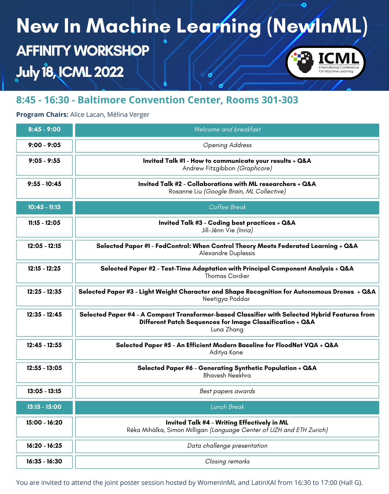

# New in ML workshop at ICML 2022

  

## Global information
* [Registration Form](https://forms.gle/ajda5xPw7RfdjKnw6)
* [Invited Speakers](./speakers-page.md)
* [Call for papers](./call-for-papers.md)
* [Organization Team](./organizers-page.md)
* [ICML 2022 Main Conference](https://icml.cc/)

## On-site attendance details for July 18, 2022
* Rooms 301-303, Baltimore Convention Center
* 8:45 - 9:00 - Welcome
* 9:00 - Workshop start

## Online attendance details for July 18, 2022
* Workshop virtual site: [link](https://icml.cc/virtual/2022/affinity-workshop/13480)
* 9:00 - Workshop start
* Use the Rocket.Chat for questions (please remain polite and considerate of other attendees or speakers)

## Registrations: Being registered for any component of the conference (tutorials, conference sessions, workshops, virtual only pass) allows you to attend any affinity events, including our workshop!
* [Pricing](https://icml.cc/Conferences/2022/Pricing)
* [Register to ICML](https://icml.cc/Register2)
* [Fill out the registration form](https://forms.gle/ajda5xPw7RfdjKnw6)

# Our Mission

Is this your first time to a top conference? Have you ever wanted your own work recognized by this huge and active community? Do you encounter difficulties in polishing your ideas, experiments, paper writing, etc? Then, this session is exactly for you!

This year, we are hosting again the New in ML workshop, co-locating with [ICML 2022](https://icml.cc/). This workshop is intended for anyone who has not published a paper at a top conference yet (e.g. ICML, NeurIPS). We invited top researchers to review your work and share their experience with you. The best papers will get oral presentations and awards!

  

Our biggest goal is to help you publish papers at the next ICML conference, and generally provide you with the guidance you need to contribute to ML research fully and effectively!

Within quota limits, the authors of the best accepted papers may be receiving tickets to ICML 2022, to be attributed according to merit and need. In addition, we should be able to provide **financial help** for travel/accommodation/registration expanses and fees.

# Past editions

* [NeurIPS 2021](https://sunhaozhe.github.io/NewInML2021_NeurIPS/)
* [NeurIPS 2020](https://vanyacohen.github.io/NewInML/)
* [ICML 2020](https://nehzux.github.io/NewInML2020ICML/)
* [NeurIPS 2019](https://nehzux.github.io/NewInML2019/)

# Registration

Though labeled as an affinity workshop, this workshop is **open to everyone**. It is a **requirement** to register for the [ICML 2022 conference](https://icml.cc/) in order to attend the workshops, socials and anything connected to the ICML Conference platform, **including** this workshop. **Being registered for any component of the conference (tutorials, conference sessions, workshops, virtual only pass) allows you to attend any affinity events, including our workshop.**
In addition, we would like to have an estimate of the number of attendees and their background. **Please fill out the [registration form](https://forms.gle/ajda5xPw7RfdjKnw6) intended for this purpose.**

# Invited speakers

[See more information about our invited speakers](./speakers-page.md)

# Call for papers

[See more information about our call for papers](./call-for-papers.md)

# Program

This will be a one-day **hybrid on site/online** event in Baltimore, USA.

  

Program (Baltimore time zone: Eastern Daylight Time/UTC−4 ):

**Monday July 18, 2022 - Baltimore Convention Center, Room 301 - 303**

|**Time**  | **Event**|
|-|--------------------------------------------------|
|09:00 - 09:05| **Opening address** |
|09:05 - 09:55| **Invited Talk**  How to communicate your results - [Andrew Fitzgibbon](https://www.fitzgibbon.ie/) (Graphcore) |
|09:55 - 10:45| **Invited talk** Collaborations with ML researchers - [Rosanne Liu](https://rosanneliu.com/) (ML Collective, Google Brain) |
|10:45 - 11:15| Break |
|11:15 - 12:05| **Invited Talk** Coding best practices - [Jill Jênn Vie](https://jjv.ie/) (Inria) |
|12:05 - 13:05| **Best abstracts presentations** (5-min presentations + 5-min Q&A for each paper) |
|13:05 - 13:15| **Best extended abstract award** |
|13:15 - 15:00| Lunch Break |
|15:00 - 16:00| **Invited talk** Writing effectively for ML - Réka Mihálka, Simon Milligan (Language Center of UZH and ETH Zurich) |
|16:00 - 16:20| **Discussion** - Réka Mihálka, Simon Milligan (Language Center of UZH and ETH Zurich) |
|16:20 - 16:30| Closing remarks |

You are invited to attend the joint poster session hosted by WomenInML and LatinXAI from 16:30 to 17:00 (Hall G).

  

You can find the program and workshop virtual site on the following [link](https://icml.cc/virtual/2022/affinity-workshop/13480).

# Accepted extended abstracts

* *A Compact Transformer-based Classifier with Selected Hybrid Features from Different Patch Sequences for Image Classification*, Luna Zhang

* *An Efficient Modern Baseline for FloodNet VQA*, Aditya Kane, Sahil Khose

* *FedControl: When Control Theory Meets Federated Learning*, Adnan Ben Mansour, Gaia Carenini, Alexandre Duplessis, David Naccache

* *Generating Synthetic Population*, Bhavesh Neekhra, Kshitij Kapoor, Debayan Gupta

* *Light Weight Character and Shape Recognition for Autonomous Drones*, Neetigya Poddar, Shruti Praveen Jain

* *Test-Time Adaptation with Principal Component Analysis*, Thomas Cordier, Victor Bouvier, Gilles Hénaff, Céline Hudelot

# Organization Team
[See more information about our organization team](./organizers-page.md)

# Sponsors
   [4Paradigm](https://en.4paradigm.com/index.html)

  [ChaLearn](http://www.chalearn.org/)

# Contact

Write us at: contactnewinml (at) gmail.com

 Follow us on Twitter: [@NewInML](https://twitter.com/NewInML)
