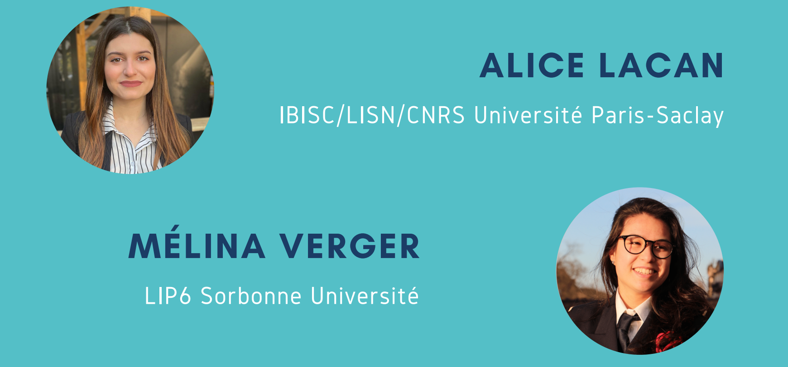
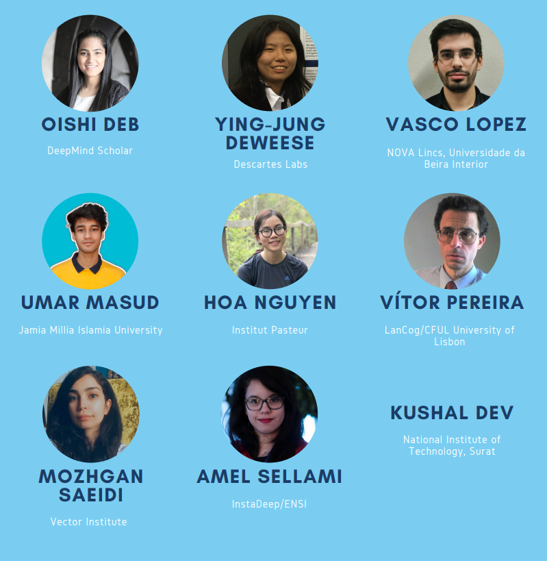

# Workshop Organization Team

* [Back to homepage](./)
* [See workshop invited speakers](./speakers-page.md)

## Leading organizers

  

* [Alice Lacan](https://www.linkedin.com/in/alice-lacan/)
* [Mélina Verger](https://melinaverger.GitHub.io/)

## Additional organizers

  

* [Oishi Deb](https://twitter.com/DebOishi)
* Kushal Dev
* [Ying-Jung Deweese](https://www.linkedin.com/in/ying-jung-deweese/)
* [Vasco Lopez](https://www.linkedin.com/in/vasco-lopes/)
* [Umar Masud](https://umar07.github.io/)
* [Hoa Nguyen](https://www.linkedin.com/in/hoa-nguyen-95a127104)
* [Vitor Manuel Diniz Pereira](https://scholar.google.com/citations?user=aF-fuJgAAAAJ&hl=en)
* [Mozhgan Saeidi](https://linkedin.com/in/mojgansaeidi)
* [Amel Sellami](https://developers.google.com/community/experts/directory/profile/profile-amel-sellami)

## Advisors
* Isabelle Guyon (LISN/CNRS/INRIA Université Paris-Saclay, ChaLearn)
* Haozhe Sun (LISN/CNRS/INRIA Université Paris-Saclay)
* Zhen Xu (4Paradigm)

## Reviewing Committee
* Piyush Bansal (Facebook/ Meta Inc.)
* João Brito (DeepNeuronic)
* Wei-Lun Chao (The Ohio State University)
* Oishi Deb (DeepMind Scholar 20/21, previously Rolls-Royce)
* Bruno Degardin (Universidade de Beira Interior)
* Ying-Jung Deweese (Descartes Labs)
* Yan Gao (UTHSC)
* Xiaodan Hu (UIUC)
* Nicholas Monath (Google)
* Naila Murray (Meta AI Research)
* Ankita Naik (University of Massachusetts Amherst)
* Joao Neves (Universidade de Beira Interior)
* Hoa Nguyen Thi Thanh (Institut Pasteur)
* Shilpa Pandey (Adani Institute of Infrastructure Engineering)
* Homa Rashidisabet (University of Illinois at Chicago)
* Bastian Rieck (Helmholtz Munich)
* David Ross (Google)
* Francisco Ruiz (DeepMind)
* Mozhgan Saeidi (Vector Institute)
* Amel Sellami (InstaDeep/ENSI)
* Vishakha Sharma (Roche)
* Max Simchowitz (MIT)
* Sahib Singh (Ford Motor Company)
* Jonathan Uesato (Google/DeepMind)
* Jennifer Williams (Carnegie Mellon University)

## Sponsors

   [4Paradigm](https://en.4paradigm.com/index.html)

  [ChaLearn](http://www.chalearn.org/)
