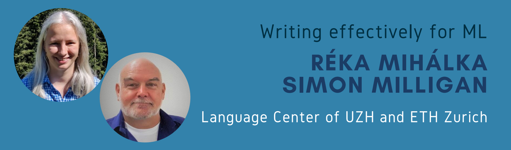

# Workshop Invited Speakers

* [Back to homepage](./)
* [See workshop organization team](./organizers-page.md)

  

### Short bio
Andrew Fitzgibbon has been closely involved in the delivery of three groundbreaking computer vision systems over two decades. In 2000, he was computer vision lead on the Emmy-award-winning 3D camera tracker “Boujou”; in 2009 he introduced large-scale synthetic training data to Kinect for Xbox 360, and in 2019 was science lead on the team that shipped fully articulated hand tracking on HoloLens 2. His passion is bringing the power of mathematics to the crucible of real-world engineering. He has numerous research awards, including ten “best paper” prizes at leading conferences, and is a Fellow of the UK’s Royal Academy of Engineering.

* [Personal website](https://www.fitzgibbon.ie/)

  

### Short bio
Rosanne Liu is a research scientist at Google Brain, and co-founder and executive director of ML Collective, a non-profit organization providing research training for all. She was also a founding member of Uber AI. She obtained her PhD in Computer Science at Northwestern University, published research at NeurIPS, ICLR, ICML, Science and other top venues, and had her work featured by WIRED, MIT Tech Review and Fortune. She builds communities for underrepresented and unprivileged researchers, organizes symposiums, workshops, and a weekly reading group “Deep Learning: Classics and Trends” since 2018. She serves as the Diversity, Equity & Inclusion chair of ICLR 2022 and 2023.

* [Personal website](https://rosanneliu.com/)

  

### Short bio
Jill-Jênn Vie is a research scientist at Inria, Soda team, interested in online factorization, deep generative models and educational applications of machine learning. He is teaching deep learning and algorithms, complexity and programming. During his career, he designed and implemented a free software that is used to certify the digital skills of every French citizen (Pix). He also founded a programming summer school for K-12 girls named [Girls Can Code!](https://girlscancode.fr/) running since 2014. He served as general chair of the EDM 2021 conference and he is currently on the editorial board of the Journal of Educational Data Mining.

* [Personal website](https://jjv.ie/)

  

### Short bio - Réka Mihálka
Réka Mihálka is a scientific writing expert, who is currently teaching at ETH Zurich and the University of Zurich. In her teaching, her primary objective is to help researchers communicate their findings by writing clear, precise, and concise papers. Her research focuses on the didactical aspects of writing instruction: she is experimenting with gamification and autonomous learning to increase engagement. Her current project is to create a scientific writing app tailored to computer scientists.

### Short bio - Simon Milligan
Dr Simon Milligan has 20 years' experience as an academic language editor in a range of social and natural sciences and is a member of the European Association of Science Editors. He has also taught scientific writing at the Universities of Bern and Zurich and at the ETH in Zurich for over 15 years. He has developed a number of writing courses tailored to the needs of specific fields, including applied mathematics, biomedical engineering, biochemistry, chemistry, climate science, computer science, environmental engineering, evolutionary biology, materials science, mechanical engineering, neuroscience, philosophy, and psychology.

* [Website](https://acalanser.ch/)
